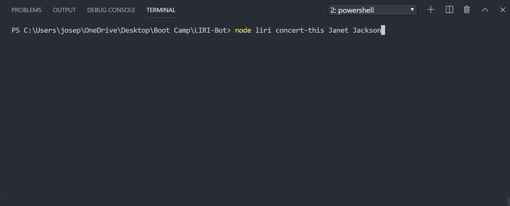

# LIRI-Bot

## About

LIRI-Bot is a one stop entertainment information scouter for all your movie, song and concert needs!

## Overview

LIRI will search Spotify for songs, Bands in Town for concerts, and OMDB for movies based on a single line command input and search term provided by the user.

## Technologies

The app is a javaScript function that:

i. extracts pre-defined required fields

ii. from entertainment based APIs using axios

iii. executed via Node

using the search term provided by the user.

## Instructions

### 1. For Concerts:

- `node liri.js concert-this <artist/band name here>`

  - This will search the Bands in Town Artist Events API (`"https://rest.bandsintown.com/artists/" + artist + "/events?app_id=codingbootcamp"`) for an artist and render the following information about each event to the terminal:

    - Name of the venue

    - Venue location

    - Date of the Event ("MM/DD/YYYY")



### 2. For Songs:

- `node liri.js spotify-this-song '<song name here>'`

  - This will show the following information about the song in your terminal/bash window

    - Artist(s)

    - The song's name

    - A preview link of the song from Spotify

    - The album that the song is from

  - If no song is provided then your program will default to "The Sign" by Ace of Base.


### 3. For Movies:

- `node liri.js movie-this '<movie name here>'`

  - This will output the following information to your terminal/bash window:

    ```
      * Title of the movie.
      * Year the movie came out.
      * IMDB Rating of the movie.
      * Rotten Tomatoes Rating of the movie.
      * Country where the movie was produced.
      * Language of the movie.
      * Plot of the movie.
      * Actors in the movie.
    ```

  - If the user doesn't type a movie in, the program will output data for the movie 'Mr. Nobody.'


### 4. Instructions From Text File:

- `node liri.js do-what-it-says`

  - LIRI will take the text inside of random.txt and then use it to call one of LIRI's commands.

    - Example: It should run `spotify-this-song` for "I Want it That Way," as follows the text in `random.txt`.

    - Edit the text in random.txt to test out the feature for movie-this and concert-this.


## Additional Feature

- In addition to logging the data to your terminal/bash window, all of your search results are logged in `log.txt`.


## Link to Deployment

- Not Applicable as this can only be run from Node
